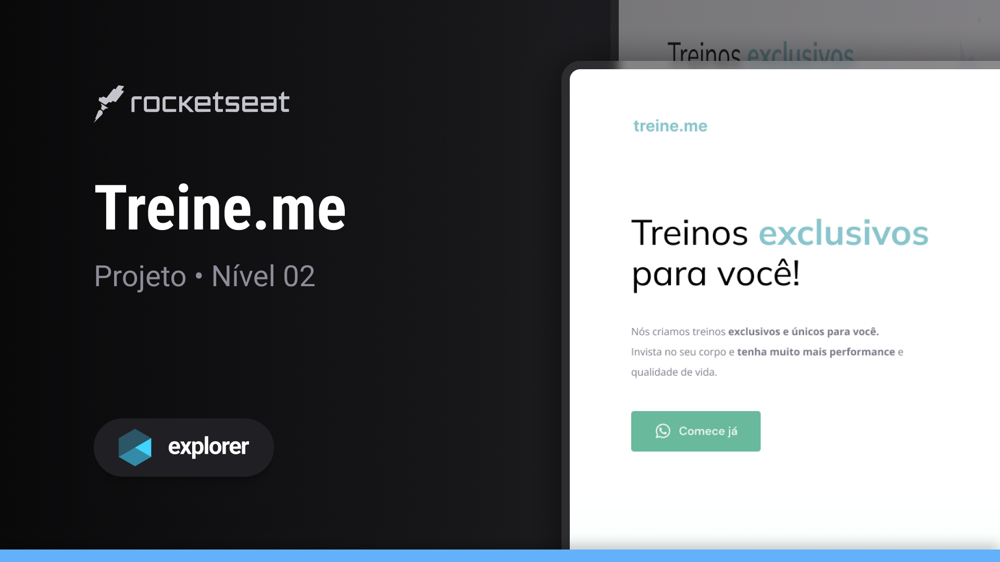
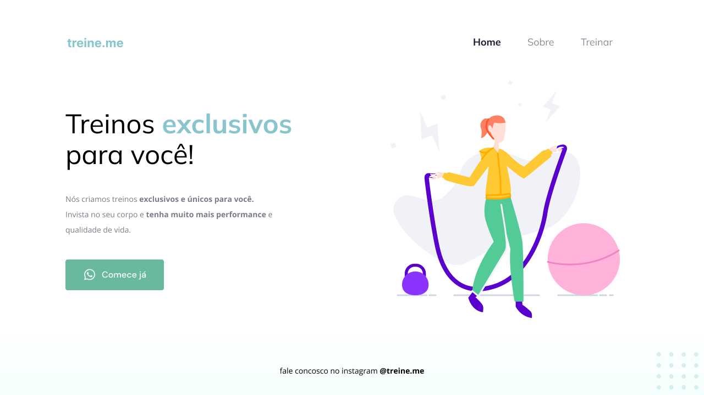

## Sobre o projeto

O projeto compreende uma interface web básica, desenvolvida como parte da jornada Explorer da Rocketseat. 
O objetivo primordial é explorar os princípios fundamentais de estrutura semântica e flexbox. Durante as sessões, foram empregadas as seguintes ideias:

## Ideias Aplicadas

* Fundamentos de HTML e CSS para estruturação semântica
* Aprendizado da ferramenta Figma
* Implementação de estilos, fontes e paletas personalizadas em nossos projetos
* Compreensão de técnicas de posicionamento e espaçamento dos elementos usando os conceitos de Modelo de Caixa e Flexbox do CSS

## Tecnologias
- HTML
- CSS
- Figma

## Layout do projeto
<table>
  <tr>
    <td></td>
  </tr>   
</table>

## Demonstração
Aqui está uma prévia do resultado final do projeto desenvolvido
[Link Demonstração](https://rs-ferreira.github.io/TreineMe/)

## Desafio
A partir deste projeto, foi lançado um desafio para recriar o layout utilizando os mesmos princípios, mas com uma temática diferente. Mais detalhes do desafio podem ser encontrados clicando aqui
[rocket-sect](https://rs-ferreira.github.io/Rocket.Sect/).

## Contato
Em caso de dúvidas ou para entrar em contato, sinta-se à vontade para enviar uma mensagem pelo 
[LinkedIn](https://www.linkedin.com/in/ronaldosf).

<a href="#readme-top">voltar ao topo</a>

